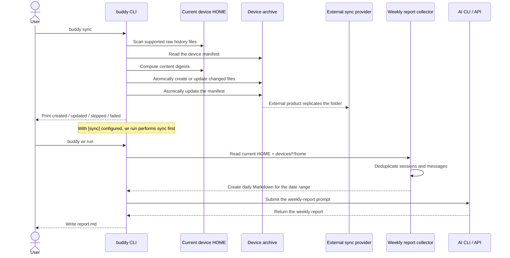

# `buddy sync` behavior

`buddy sync` incrementally copies supported raw AI conversation histories from the current device into a user-selected local directory. To make the archive available across devices, place that directory inside any folder managed by an external synchronization product, such as a cloud-drive client. buddy only performs local filesystem operations and does not depend on or call any synchronization-provider API.

## Configuration and usage

Configure the same archive path and a different device name on every device in `~/.config/buddy/config.toml`:

```toml
[sync]
path = "/path/to/cloud-synced-folder/buddy-history"
device = "work-laptop"
```

Run a manual sync:

```sh
buddy sync
buddy sync --agents codex,claude
```

`--path`, `--device`, and `--home` override configuration values. `--agents` limits the sources included in that run.

## Synced content

buddy does not copy the entire HOME directory. It copies only records supported by the current parsers:

| Source | Synced content |
| --- | --- |
| Codex | JSONL files under `.codex/sessions` |
| Cursor | JSONL files under `agent-transcripts` in `.cursor/projects` |
| Claude | JSONL files under `.claude/projects` |
| Gemini | Classic session JSON, `.project_root`, Antigravity transcripts, and `history.jsonl` |

The destination is namespaced by device:

```text
<sync.path>/
`-- devices/
    |-- work-laptop/
    |   |-- .buddy-sync-manifest.json
    |   `-- home/.codex|.cursor|.claude|.gemini/...
    `-- home-pc/
        |-- .buddy-sync-manifest.json
        `-- home/...
```

Every run scans supported files and computes a content digest:

- New files are copied into the current device archive and counted as `created`.
- Files whose content changed are safely replaced and counted as `updated`.
- Files with the same digest and size are not rewritten and are counted as `skipped`.
- Deleting local history does not delete its archived copy.
- Symbolic links are not followed.
- A destination inside a source history directory is rejected to prevent recursive copies.
- One file failure does not stop the remaining files, but the command ultimately fails and lists the errors.

Both history files and the manifest are written to a temporary file in the destination directory before replacing the live file. If replacement fails, buddy attempts to restore the previous file so readers do not observe a partially written file.

## Weekly-report integration

With a complete `[sync]` configuration:

- `buddy wr run` synchronizes the current device first, then reads every `devices/*/home` plus the current HOME. A sync failure stops report generation to avoid producing an incomplete report.
- `buddy wr run --no-sync` does not write to the archive, but still reads the existing archive and current HOME.
- `buddy wr collect` does not perform a sync, but reads the existing archive and current HOME.
- `buddy wr report` summarizes previously generated daily Markdown and does not read raw history again.
- Without `[sync]`, all `wr` commands retain their original local-only behavior.

The archive and current HOME can contain copies of the same session. Collection deduplicates them by agent, session ID, project, and message content.

## Sequence diagram



The editable draw.io version is [`buddy-sync-sequence.drawio`](buddy-sync-sequence.drawio). Its generator input is [`buddy-sync-sequence.json`](buddy-sync-sequence.json).

> Raw conversations may contain source code, filesystem paths, prompts, and secrets. buddy does not encrypt the archive, so use only a trusted synchronization directory.
