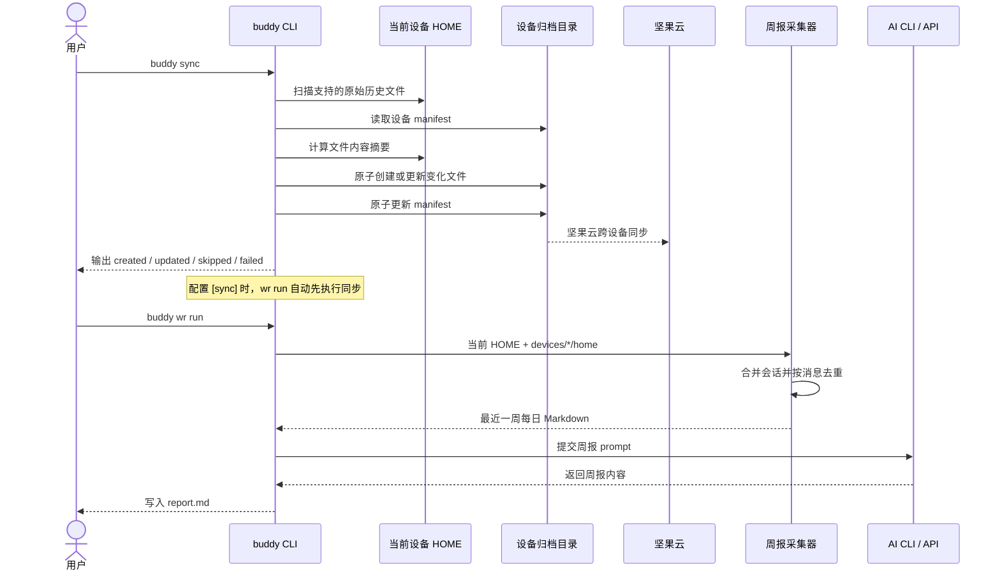

# `buddy sync` 行为说明

`buddy sync` 将当前设备中 buddy 已支持的 AI 对话原始记录增量复制到共享目录。共享目录可以放在坚果云中，由坚果云负责跨设备传输；buddy 本身不连接坚果云 API。

## 配置与运行

在 `~/.config/buddy/config.toml` 中为每台设备配置相同的归档路径和不同的设备名：

```toml
[sync]
path = "/path/to/Nutstore/buddy-history"
device = "work-laptop"
```

手动同步：

```sh
buddy sync
buddy sync --agents codex,claude
```

`--path`、`--device` 和 `--home` 可以覆盖配置；`--agents` 可限制本次同步的来源。

## 同步内容

buddy 不复制整个 HOME，只复制当前解析器支持的记录：

| 来源 | 同步内容 |
| --- | --- |
| Codex | `.codex/sessions` 中的 JSONL |
| Cursor | `.cursor/projects` 中 `agent-transcripts` 下的 JSONL |
| Claude | `.claude/projects` 中的 JSONL |
| Gemini | classic session JSON、`.project_root`、Antigravity transcript 和 `history.jsonl` |

目标结构按设备隔离：

```text
<sync.path>/
└── devices/
    ├── work-laptop/
    │   ├── .buddy-sync-manifest.json
    │   └── home/.codex|.cursor|.claude|.gemini/...
    └── home-pc/
        ├── .buddy-sync-manifest.json
        └── home/...
```

每次运行会扫描支持的文件并计算内容摘要：

- 新文件复制到当前设备的归档目录并计为 `created`。
- 内容发生变化的文件安全替换并计为 `updated`。
- 摘要和大小没有变化的文件不重写，计为 `skipped`。
- 本机已经删除的历史不会从归档删除。
- 符号链接不会被跟随。
- 归档目标位于任一历史源目录中时会拒绝运行，防止递归复制。
- 单文件失败不会阻止其他文件同步，但命令最终返回失败并列出错误。

文件和 manifest 都先写入同目录临时文件，再替换正式文件；替换失败时会尝试恢复旧文件，避免留下半写内容。

## 与周报的关系

配置完整的 `[sync]` 后：

- `buddy wr run` 先执行当前设备同步，再读取所有 `devices/*/home` 和当前 HOME；同步失败时不生成可能缺数据的周报。
- `buddy wr run --no-sync` 跳过写入归档，但仍读取已有归档和当前 HOME。
- `buddy wr collect` 不主动同步，但读取已有归档和当前 HOME。
- `buddy wr report` 只总结已经生成的每日 Markdown，不重新读取原始历史。
- 未配置 `[sync]` 时，所有 `wr` 命令保持原来的仅本机行为。

归档副本与当前 HOME 可能包含同一会话，采集阶段会按 Agent、会话 ID、项目和消息内容去重。

## 时序图



可编辑的 draw.io 版本见 [`buddy-sync-sequence.drawio`](buddy-sync-sequence.drawio)，生成输入见 [`buddy-sync-sequence.json`](buddy-sync-sequence.json)。

> 原始对话可能包含源码、文件路径、prompt 和敏感信息。buddy 不加密归档，请只使用可信的同步目录。
