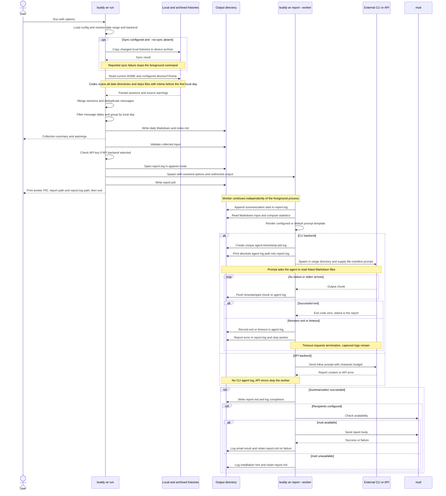

# Weekly report execution

This sequence describes the current `buddy wr run` implementation. Collection runs
in the foreground; summarization and optional email run in a separate worker.
The output root is configurable; `out/<range>` below denotes its default layout.

## Reading the flow

- The default interval is seven local calendar days including today. Explicit
  `--from` and `--to` override it; otherwise `--days` overrides `[wr].days`.
- Sync handles raw file changes independently of the report date range. An
  external sync product replicates the archive; buddy does not wait for cloud
  uploads or downloads to complete.
- Session identity is `(agent, session ID, project)`. Message deduplication uses
  millisecond timestamp, role, and content. Filtering happens per message;
  sessions spanning multiple days appear in multiple daily files.
- `wr collect` performs collection without automatic sync. `wr report` starts
  summarization from existing output. The internal `--worker` path skips sync
  and collection.
- The foreground command succeeding means the worker was launched, not that
  generation or email succeeded. Inspect `report.log` and `report.md` for the
  outcome. The agent log records emitted CLI output, not unreported internal
  activity. Logs can contain raw conversation content and credentials.

## Current limitations

- Codex scans all session directories in both live and archived homes. Only
  JSONL files with mtime before the first requested local day are skipped,
  with no upper mtime cutoff. Message timestamps still determine inclusion.
  This optimization assumes trustworthy file modification times. Restored or
  externally modified timestamps can cause omissions. Unavailable mtime emits
  a warning and the file is still read.
- Markdown input loading excludes `index.md` but currently includes other
  Markdown files, including an existing `report.md` on repeated runs.
- Archive enumeration can silently return no device homes on directory access
  failure. A successful report does not establish archive completeness.
- Multiple workers for the same range are not prevented. They share report.log
  and report.md, although CLI agent logs are separate per invocation.

## Implementation references

- [Dispatch and worker lifecycle](../src/main.rs)
- [Detached worker launch](../src/job.rs)
- [Source aggregation and summarization](../src/app.rs)
- [Message merge and date filtering](../src/collect.rs)
- [External CLI execution and logging](../src/report/cli_backend.rs)
